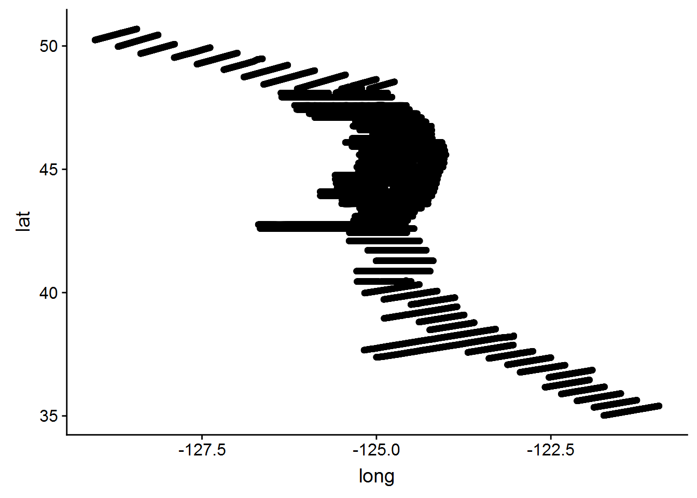
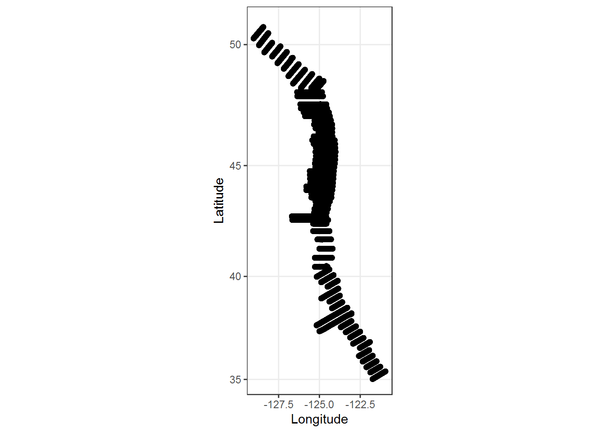
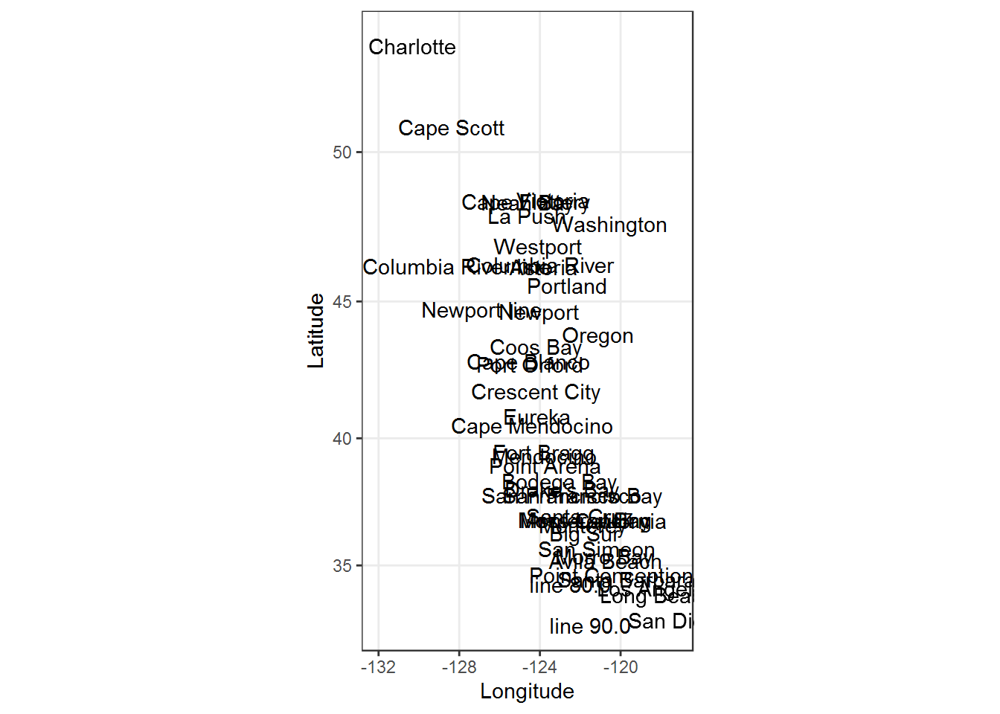
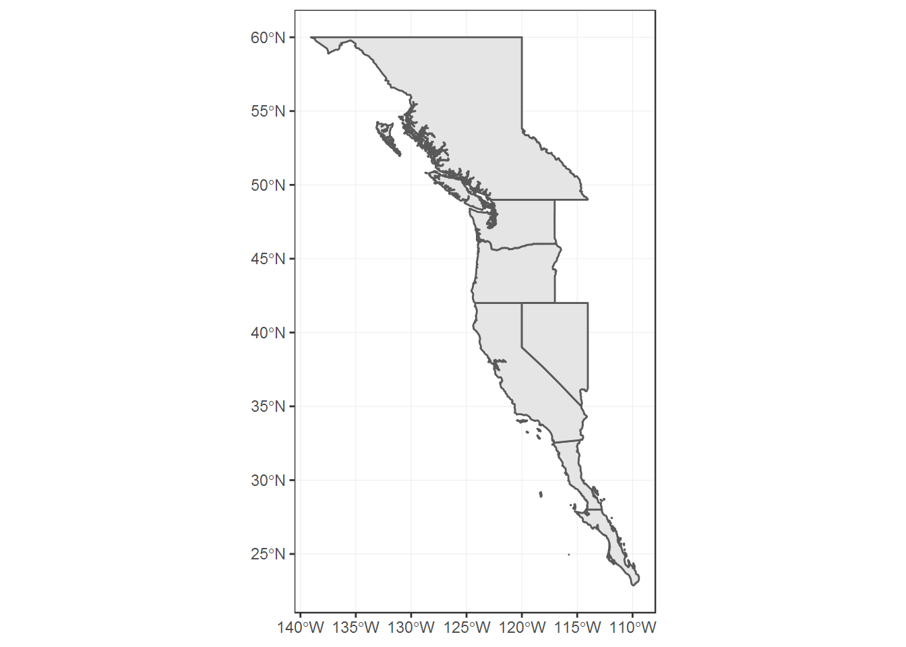
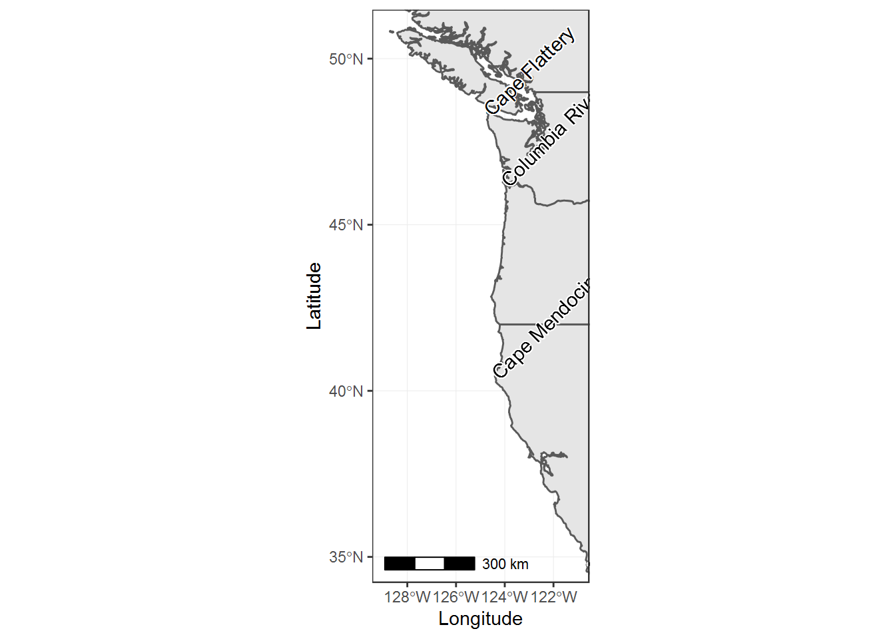

```r
# Install and load pacman (library management package)
if (!require("pacman")) install.packages("pacman")

# Install and load required packages from CRAN ---------------------------------
pacman::p_load(tidyverse,knitr,here,devtools,bookdown,bookdownplus,
               sf,rnaturalearth,rnaturalearthdata,marmap,
               ggmap,ggrepel,shadowtext,cowplot, ggspatial,
               viridis,plotly,mapproj)

# Install and load required packages from Github -------------------------------


# Set default knitr chunk options
knitr::opts_chunk$set(warning = F, message = F, 
                      dev = "png", dev.args = list(type = "cairo"))  
```

# Import some survey data

- `transect` and `interval` constitute a unique measurement
- `long` and `lat` are (x,y)
- `nasc` (Nautical Area Scattering Coefficient) ~ "acoustic biomass"


```r
# Read data file
cps <- read_csv(here("Data/cps.csv")) %>% 
  select(transect, interval, everything())

# Show first 10 rows
head(cps, 5)
```

```
## # A tibble: 5 x 5
##   transect interval  long   lat  nasc
##      <dbl>    <dbl> <dbl> <dbl> <dbl>
## 1        1        1 -121.  35.4     0
## 2        1        2 -121.  35.4     0
## 3        1        3 -121.  35.4     0
## 4        1        4 -121.  35.4     0
## 5        1        5 -121.  35.4     0
```

# Visualize the imported data


```r
# Plot lat/long
ggplot(cps, aes(long, lat)) +
  geom_point()
```



# Refine the map slightly


```r
# Plot lat/long
ggplot(cps, aes(long, lat)) +
  geom_point() +
  # Change axis labels
  xlab("Longitude") + #<<
  ylab("Latitude") +  #<<
  # Use map coords
  coord_map() + #<< 
  # Use b/w theme
  theme_bw()    #<< 
```



# Import some place labels


```r
# Subset locations
locs <- read_csv( #<<
  here("Data/locations.csv"))

# Plot lat/long
ggplot(locs) +
  # Add locations
  geom_text(aes(long, lat,
                label = name)) +
  # geom_text_repel(aes(long, lat, 
  #               label = name)) +
  xlab("Longitude") + 
  ylab("Latitude") +
  # Use map coordinates
  coord_map() +
  # Use b/w theme
  theme_bw() 
```



# Import West Coast states from `rnaturalearth`

By downloading `rnaturalearthdata`, map data are available offline!


```r
# Download worldwide states 
# and filter for Western N. Am.
states <- ne_states(
  country = c("Canada",
              "United States of America",
              "Mexico"),
  returnclass = 'sf') %>% 
  filter(name %in% c("California","Oregon",
                     "Washington","Nevada",
                     "British Columbia",
                     "Baja California",
                     "Baja California Sur"))

# Plot result
ggplot(data = states) +
  geom_sf() +
  theme_bw()
```



# Create a base map


```r
# Place labels
locs <- locs %>% 
  filter(name %in% c("Cape Flattery","Columbia River",
                     "Cape Mendocino","Point Conception"))

# Define lat and long range or survey data
wc.lat  <- range(cps$lat)
wc.long <- range(cps$long)

# Create base map
base.map <- ggplot() +
  geom_sf(data = states) +
  geom_shadowtext(data = locs,
                  aes(long, lat, label = name),
                  colour = "black", 
                  bg.colour = "white",
                  hjust = 0, angle = 45) +
  xlab("Longitude") +
  ylab("Latitude") + 
  annotation_scale(location = "bl", 
                   width_hint = 0.5) +
  coord_sf(xlim = wc.long,
           ylim = wc.lat) +
  theme_bw()

base.map
```




